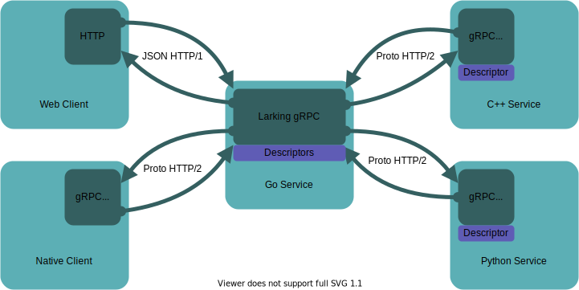

```
   _,
  ( '>   Welcome to larking.io
 / ) )
 /|^^
```
[](https://pkg.go.dev/larking.io/larking)

Larking is a [protoreflect](https://pkg.go.dev/google.golang.org/protobuf/reflect/protoreflect) gRPC-transcoding implementation with support for gRPC, gRPC-web and twirp protocols.
Bind [`google.api.http`](https://github.com/googleapis/googleapis/blob/master/google/api/http.proto) annotations to gRPC services without code generation.
Works with existing go-protobuf generators 
[`protoc-gen-go`](https://pkg.go.dev/google.golang.org/protobuf@v1.30.0/cmd/protoc-gen-go) and 
[`protoc-gen-go-grpc`](https://pkg.go.dev/google.golang.org/grpc/cmd/protoc-gen-go-grpc)
and Go's std library net/http stack.
Bind to local services or proxy to other gRPC servers using gRPC server reflection.
Use Google's [API design guide](https://cloud.google.com/apis/design) to design beautiful RESTful APIs for your gRPC services.

- Supports [gRPC](https://grpc.io) clients
- Supports [gRPC-transcoding](https://cloud.google.com/endpoints/docs/grpc/transcoding) clients
- Supports [gRPC-web](https://github.com/grpc/grpc-web) clients
- Supports [twirp](https://github.com/twitchtv/twirp) clients
- Proxy gRPC servers with gRPC [server reflection](https://github.com/grpc/grpc/blob/master/doc/server-reflection.md)
- Implicit `/GRPC_SERVICE_FULL_NAME/METHOD_NAME` for all methods
- Google API service configuration [syntax](https://cloud.google.com/endpoints/docs/grpc-service-config/reference/rpc/google.api#using-grpc-api-service-configuration)
- Websocket streaming with `websocket` kind annotations
- Content streaming with `google.api.HttpBody`
- Streaming support with [StreamCodec](https://github.com/emcfarlane/larking#streaming-codecs)
- Supports [vtprotobuf](https://github.com/planetscale/vtprotobuf) extensions
- Fast with low allocations: see [benchmarks](https://github.com/emcfarlane/larking/tree/main/benchmarks)

<div align="center">

</div>

## Install

```
go get larking.io@latest
```

## Quickstart

Compile protobuffers with go and go-grpc libraries. Follow the guide [here](https://grpc.io/docs/languages/go/quickstart/#prerequisites). No other pre-compiled libraries are required. We need to create a `larking.Mux` and optionally `larking.Server` to serve both gRPC and REST. 

This example builds a server with the health service:

```go
package main

import (
	"log"
	"net"

	"google.golang.org/genproto/googleapis/api/serviceconfig"
	healthpb "google.golang.org/grpc/health/grpc_health_v1"
	"larking.io/health"
	"larking.io/larking"
)

func main() {
	// Create a health service. The health service is used to check the status
	// of services running within the server.
	healthSvc := health.NewServer()
	healthSvc.SetServingStatus("example.up.Service", healthpb.HealthCheckResponse_SERVING)
	healthSvc.SetServingStatus("example.down.Service", healthpb.HealthCheckResponse_NOT_SERVING)

	serviceConfig := &serviceconfig.Service{}
	// AddHealthz adds a /v1/healthz endpoint to the service binding to the
	// grpc.health.v1.Health service:
	//   - get /v1/healthz -> grpc.health.v1.Health.Check
	//   - websocket /v1/healthz -> grpc.health.v1.Health.Watch
	health.AddHealthz(serviceConfig)

	// Mux impements http.Handler and serves both gRPC and HTTP connections.
	mux, err := larking.NewMux(
		larking.ServiceConfigOption(serviceConfig),
	)
	if err != nil {
		log.Fatal(err)
	}
	// RegisterHealthServer registers a HealthServer to the mux.
	healthpb.RegisterHealthServer(mux, healthSvc)

	// Server creates a *http.Server.
	svr, err := larking.NewServer(mux)
	if err != nil {
		log.Fatal(err)
	}

	// Listen on TCP port 8080 on all interfaces.
	lis, err := net.Listen("tcp", "localhost:8080")
	if err != nil {
		log.Fatalf("failed to listen: %v", err)
	}
	defer lis.Close()

	// Serve starts the server and blocks until the server stops.
	// http://localhost:8080/v1/healthz
	log.Println("gRPC & HTTP server listening on", lis.Addr())
	if err := svr.Serve(lis); err != nil {
		log.Fatalf("failed to serve: %v", err)
	}
```

Running the service we can check the health endpoints with curl:
```sh
> curl localhost:8080/grpc.health.v1.Health/Check
{"status":"SERVING"}
```

To filter by service you can post the body `{"service": "example.down.Service"}` or use query params:
```sh
> curl 'localhost:8080/grpc.health.v1.Health/Check?service=example.down.Service'
{"status":"NOT_SERVING"}
```

We can also use the `/v1/healthz` endpoint added by `health.AddHealthz`:
```sh
> curl 'localhost:8080/v1/healthz?service=example.up.Service'
{"status":"SERVING"}
```

## Features

Transcoding provides methods to bind gRPC endpoints to HTTP methods.
An example service `Library`:
```protobuf
package larking.example

service Library {
  // GetBook returns a book from a shelf.
  rpc GetBook(GetBookRequest) returns (Book) {};
}
```

Implicit bindings are provided on all methods bound to the URL
`/GRPC_SERVICE_FULL_NAME/METHOD_NAME`.
 
For example to get the book with curl we can send a `POST` request:
```
curl -XPOST http://domain/larking.example.Library/GetBook -d '{"name":"shelves/1/books/2"}
```

We can also use any method with query parameters. The equivalent `GET` request:
```
curl http://domain/larking.example.Library/GetBook?name=shelves/1/books/2
```

As an annotation this syntax would be written as a custom http option:
```protobuf
rpc GetBook(GetBookRequest) returns (Book) {
  option (google.api.http) = {
    custom : {kind : "*" path : "/larking.example.Library/GetBook"}
    body : "*"
  };
};
```

To get better URL semantics lets define a custom annotation:
```protobuf
rpc GetBook(GetBookRequest) returns (Book) {
  option (google.api.http) = {
    get : "/v1/{name=shelves/*/books/*}"
  };
};
```

Now the equivalent `GET` request would be:
```
curl http://domain/v1/shelves/1/books/2
```

See the reference docs for [google.api.HttpRule](https://cloud.google.com/endpoints/docs/grpc-service-config/reference/rpc/google.api#google.api.HttpRule) type for all features.

### Extensions
It aims to be a superset of the gRPC transcoding spec with better support for streaming. The implementation also aims to be simple and fast.
API's should be easy to use and have low overhead.
See the `benchmarks/` for details and comparisons.

#### Arbitrary Content

Send any content type with the protobuf type `google.api.HttpBody`.
Request bodies are unmarshalled from the body with the `ContentType` header.
Response bodies marshal to the body and set the `ContentType` header.
For large requests streaming RPCs support chunking the file into multiple messages.

```protobuf
import "google/api/httpbody.proto";

service Files {
  // HTTP | gRPC
  // -----|-----
  // `POST /files/cat.jpg <body>` | `UploadDownload(filename: "cat.jpg", file:
  // { content_type: "image/jpeg", data: <body>})"`
  rpc UploadDownload(UploadFileRequest) returns (google.api.HttpBody) {
    option (google.api.http) = {
      post : "/files/{filename}"
      body : "file"
    };
  }
  rpc LargeUploadDownload(stream UploadFileRequest)
      returns (stream google.api.HttpBody) {
    option (google.api.http) = {
      post : "/files/large/{filename}"
      body : "file"
    };
  }
}
message UploadFileRequest {
  string filename = 1;
  google.api.HttpBody file = 2;
}
```

To better support stream uploads use the `AsHTTPBodyReader` and `AsHTTPBodyWriter` methods.
The returned `io.Reader` and `io.Writer` efficiently stream bytes for large messages.
This methods only works on streaming requests or streaming responses for gRPC-transcoding streams.
```go
// LargeUploadDownload echoes the request body as the response body with contentType.
func (s *asHTTPBodyServer) LargeUploadDownload(stream testpb.Files_LargeUploadDownloadServer) error {
	var req testpb.UploadFileRequest
	r, _ := larking.AsHTTPBodyReader(stream, &req)
	log.Printf("got %s!", req.Filename)

	rsp := httpbody.HttpBody{
		ContentType: req.File.GetContentType(),
	}
	w, _ := larking.AsHTTPBodyWriter(stream, &rsp)

	_, err := io.Copy(w, r)
	return err
}
```

#### Websockets Annotations
Annotate a custom method kind `websocket` to enable clients to upgrade connections. This enables streams to be bidirectional over a websocket connection.
```protobuf
// Chatroom shows the websocket extension.
service ChatRoom {
  rpc Chat(stream ChatMessage) returns (stream ChatMessage) {
    option (google.api.http) = {
      custom : {kind : "websocket" path : "/v1/{name=rooms/*}"}
      body : "*"
    };
  }
}
```

#### Streaming Codecs
Streaming requests will upgrade the codec interface to read and write marshalled messages to the stream.
Control of framing is given to the application on a per content type basis.
If the underlying protocol has it's own message framing, like 'websockets', streaming codecs won't be used.
Unlike gRPC streams where compression is _per message_ here the compression is per _stream_ so only a message delimiter is needed.
See the [StreamCodec](https://pkg.go.dev/larking.io/larking#StreamCodec) docs for implementation details.
- Protobuf messages use a varint delimiter encoding: `<varint><binary-message>`.
- JSON messages are delimited on the outer JSON braces `{<fields>}`.
- Arbitrary content is delimited by the message size limit, chunking into bytes slices of length limit.

To stream json we can append payloads together as a single payload:
```
curl -XPOST http://larking.io/v1/streaming -d '{"message":"one"}{"message":"two"}'
```
The above creates an input stream of two messages.
(N.B. when using HTTP/1 fully bidirectional streaming is not possible. All stream messages must be written before receiving a response)

To stream protobuf we can use [protodelim](https://pkg.go.dev/google.golang.org/protobuf@v1.30.0/encoding/protodelim) to read and write varint streams of messages. Similar libraries are found in other [languages](https://github.com/protocolbuffers/protobuf/issues/10229).

#### Twirp
Twirp is supported through gRPC-transcoding with the implicit methods.
The implicit methods cover `POST /package.Service/Method/` matching the content types for both `application/json` and `application/proto`.
Before the [v7 spec](https://twitchtv.github.io/twirp/docs/spec_v7.html) the URL required the `/twirp` prefix.
We can encode the server to use a ServerOption:
```go
svr, _ := larking.NewServer(mux,
  larking.MuxHandleOption("/", "/twirp"), // Serve mux on '/' and '/twirp'
)
```

Twirp [errors](https://twitchtv.github.io/twirp/docs/errors.html) are created from `*grpc.Status` errors.
Code enums are mapped to twirp error strings and messages. Currently meta fields aren't supported.
Errors will only be converted to twirp errors when the header `Twirp-Version` is set.
This is used to identify a twirp request.

#### External Configuration
Mux can be configured with external rules using [`*serviceconfig.Service`](https://pkg.go.dev/google.golang.org/genproto/googleapis/api/serviceconfig). Load the file from yaml defintions or declare in Go.

```go
mux, _ := larking.NewMux(
  larking.ServiceConfigOption(sc), // sc type of *serviceconfig.Service
)
```
